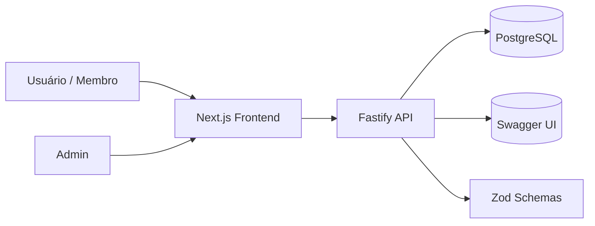
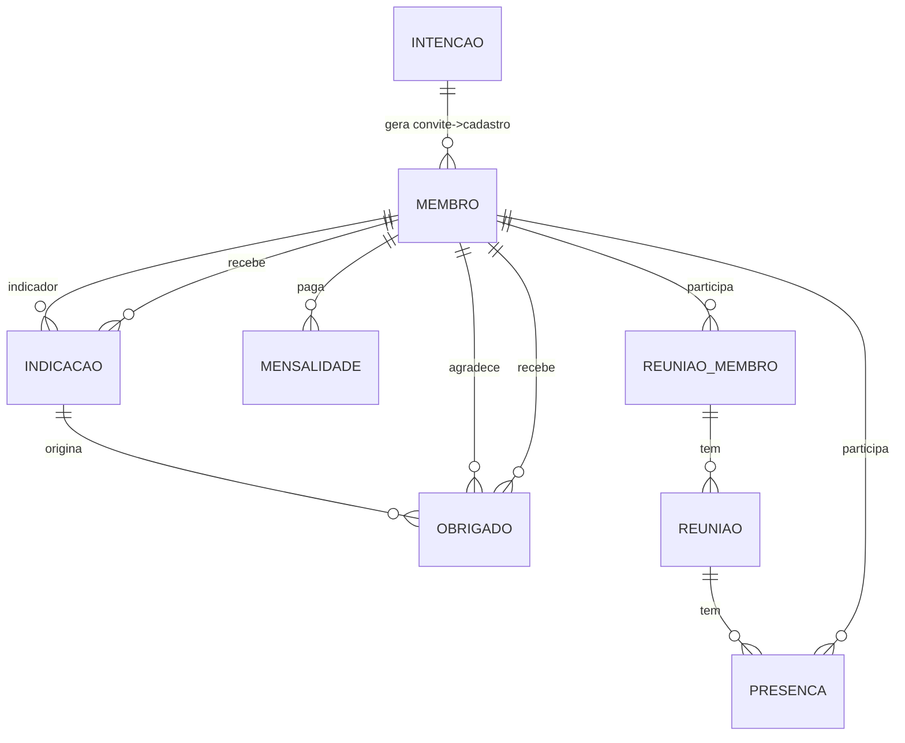

# Documento de Arquitetura – Plataforma de Gestão de Networking (Nexihub)

## 1. Visão Geral

A plataforma digitaliza o fluxo de admissão e gestão de membros de um grupo de networking, centralizando indicações, agradecimentos, reuniões e presença. Foco em uma base escalável, tipada e validada ponta-a-ponta usando TypeScript + Zod, com backend Fastify de alta performance e frontend Next.js.

## 2. Objetivos Principais

- Digitalizar o processo de intenção e aprovação de novos membros.
- Permitir acompanhamento de reuinões 1-1, presença, indicações e agradecimentos.
- Drashboards e relatórios a cerca dos dados da plataforma.
- Garantir base escalável, testável e válida via tipagem forte (TypeScript + Zod).

## 3. Stack Técnica

| Camada | Tecnologia | Justificativa |
|--------|------------|---------------|
| Frontend | Next.js (App Router) | SSR/SSG híbrido, otimização, rotas segmentadas, fácil proteção por middleware. |
| UI | React + Componentes desacoplados, Tailwind CSS e Radix | Reuso, testabilidade e produtividade. |
| Validação | Zod | Sincroniza schemas no backend e frontend (type inference). |
| Estado remoto | TanStack Query (React Query) | Cache, revalidação, controle de loading/error. |
| Backend API | Fastify (Node.js + TypeScript) | Alto desempenho, tipagem dos handlers, fácil plugin architecture. |
| Documentação API | @fastify/swagger + @fastify/swagger-ui | Geração automática de OpenAPI a partir dos schemas. |
| ORM | Drizzle ORM (PostgreSQL) | Migrações SQL geradas, tipagem estática, integração natural com Zod (`drizzle-zod`). |
| Banco | PostgreSQL | Relacional, integridade referencial, arrays, performance em consultas de métricas. |
| Autenticação mínima | Token de convite + Chave ADMIN via env | Escopo do teste dispensa auth completa. |
| Testes | Jest + React Testing Library + supertest (ou vitest) | Cobertura de componentes e rotas. |
| Infraesfutura | Docker + .env | Facilita reprodução e CI. |


Alternativas: MongoDB (flexibilidade) ou SQLite (setup super simples). Escolhido PostgreSQL pela clareza relacional (Indicações -> Membros), integridade referencial e facilidade de migração.

## 4. Diagrama de Arquitetura



## 5. Modelo de Dados (Tabelas)

- Membro
- IntencaoParticipacao
- Indicacao
- Obrigado
- Reuniao
- ReuniaoMembro
- Presenca
- Mensalidade

### 5.1 Justificativa do Banco de dados

O banco selecionado para fazer o projeto foi o PostgreSQL. 
O PostgreSQL é um banco de dados relacional, o que permite uma tipagem forte, relação entre tabelas e consultas personalizadas rápidas, para escalabilidade de estruturas de dados complexos, bancos relacionais tem a vantagem de poder criar relações com chaves primárias, secundarias e compostas, além de trabalhar muito bem por paginação com offset ou cursor e criação de views e indices para aumentar o desempenho de consultas personalizadas, dashboards e relatórios.

### 5.2 Relacionamentos (ER Simplificado)



### 5.3 Entidades / Tabelas

- **Membros**
Representa cada participante do grupo de networking, incluindo admins.  
Campos como `tipo`, `status_membro` e `agradecimentos_publicos` permitem controle claro de perfil e engajamento.

- **Intenções de Participação**
Fluxo inicial do candidato. Armazena dados básicos e controla aprovação/recusa.  
Inclui geração de `token_convite` e validade.

- **Indicações**
Registra os negócios indicados entre membros, com status evolutivo (`pendente`, `em_prospeccao`, `fechado`, `perdido`).

- **Obrigados**
Agradecimentos públicos derivados de indicações fechadas.

- **Reuniões**
Controle de reuniões gerais ou selecionadas, com registro de check-in de membros.

- **ReuniõesMembros**
Tabela de relacionamento para reuniões de 1 to 1 entre membros

- **Presenças**
Controle de chek-in's dos membros nas reuniões.

- **Mensalidades**
Módulo financeiro básico: registra mensalidade, status de pagamento e referência mensal.

### 5.3 Schemas das tabelas

```sql

-- Script SQL para criar todas as tabelas do sistema de networking

-- Criar ENUMs
CREATE TYPE tipo_membro AS ENUM ('admin', 'membro');
CREATE TYPE status_membro AS ENUM ('ativo', 'pendente', 'recusado');
CREATE TYPE status_intencao AS ENUM ('pendente', 'aprovado', 'recusado');
CREATE TYPE status_indicacao AS ENUM ('pendente', 'em_prospeccao', 'fechado', 'perdido');
CREATE TYPE tipo_reuniao AS ENUM ('geral', 'selecionada');

-- Tabela Membros
CREATE TABLE membros (
    id TEXT PRIMARY KEY,
    nome TEXT NOT NULL,
    email TEXT NOT NULL UNIQUE,
    tipo tipo_membro NOT NULL DEFAULT 'membro',
    celular TEXT NOT NULL,
    senha_hash TEXT NOT NULL,
    ramo TEXT NOT NULL,
    descricao TEXT NOT NULL,
    status_membro status_membro NOT NULL DEFAULT 'pendente',
    data_entrada TIMESTAMP NOT NULL DEFAULT NOW(),
    agradecimentos_publicos INTEGER NOT NULL DEFAULT 0,
    experiencias JSONB NOT NULL DEFAULT '[]'::JSONB
);

-- Índices para membros
CREATE INDEX idx_membros_email ON membros(email);
CREATE INDEX idx_membros_tipo ON membros(tipo);
CREATE INDEX idx_membros_status ON membros(status_membro);

-- Tabela Intenções de Participação
CREATE TABLE intencoes_participacao (
    id TEXT PRIMARY KEY,
    nome TEXT NOT NULL,
    email TEXT NOT NULL,
    celular TEXT NOT NULL,
    status status_intencao NOT NULL DEFAULT 'pendente',
    data_solicitacao TIMESTAMP NOT NULL DEFAULT NOW(),
    token_convite TEXT NOT NULL UNIQUE,
    token_expira_em TIMESTAMP NOT NULL
);

-- Índices para intenções de participação
CREATE INDEX idx_intencoes_status ON intencoes_participacao(status);
CREATE INDEX idx_intencoes_token ON intencoes_participacao(token_convite);

-- Tabela Indicações
CREATE TABLE indicacoes (
    id TEXT PRIMARY KEY,
    id_membro_indicador TEXT NOT NULL,
    id_membro_recebeu TEXT NOT NULL,
    nome_cliente TEXT NOT NULL,
    email_cliente TEXT NOT NULL,
    telefone_cliente TEXT NOT NULL,
    motivo TEXT,
    status status_indicacao NOT NULL DEFAULT 'pendente',
    data_criacao TIMESTAMP NOT NULL DEFAULT NOW(),
    data_fechamento TIMESTAMP,
    CONSTRAINT fk_indicacao_indicador 
        FOREIGN KEY (id_membro_indicador) 
        REFERENCES membros(id) 
        ON DELETE CASCADE,
    CONSTRAINT fk_indicacao_recebedor 
        FOREIGN KEY (id_membro_recebeu) 
        REFERENCES membros(id) 
        ON DELETE CASCADE
);

-- Índices para indicações
CREATE INDEX idx_indicacoes_indicador ON indicacoes(id_membro_indicador);
CREATE INDEX idx_indicacoes_recebedor ON indicacoes(id_membro_recebeu);
CREATE INDEX idx_indicacoes_status ON indicacoes(status);
CREATE INDEX idx_indicacoes_data_criacao ON indicacoes(data_criacao);

-- Tabela Obrigados (agradecimentos)
CREATE TABLE obrigados (
    id TEXT PRIMARY KEY,
    id_indicacao TEXT NOT NULL,
    id_membro_agradecido TEXT NOT NULL,
    id_membro_recebeu TEXT NOT NULL,
    mensagem TEXT NOT NULL,
    data_criacao TIMESTAMP NOT NULL DEFAULT NOW(),
    CONSTRAINT fk_obrigado_indicacao 
        FOREIGN KEY (id_indicacao) 
        REFERENCES indicacoes(id) 
        ON DELETE CASCADE,
    CONSTRAINT fk_obrigado_agradecido 
        FOREIGN KEY (id_membro_agradecido) 
        REFERENCES membros(id) 
        ON DELETE CASCADE,
    CONSTRAINT fk_obrigado_recebeu 
        FOREIGN KEY (id_membro_recebeu) 
        REFERENCES membros(id) 
        ON DELETE CASCADE
);

-- Índices para obrigados
CREATE INDEX idx_obrigados_indicacao ON obrigados(id_indicacao);
CREATE INDEX idx_obrigados_agradecido ON obrigados(id_membro_agradecido);
CREATE INDEX idx_obrigados_recebeu ON obrigados(id_membro_recebeu);

-- Tabela Reuniões
CREATE TABLE reunioes (
    id TEXT PRIMARY KEY,
    titulo TEXT NOT NULL,
    descricao TEXT,
    data_hora TIMESTAMP NOT NULL,
    criada_por TEXT NOT NULL,
    tipo tipo_reuniao NOT NULL DEFAULT 'geral',
    CONSTRAINT fk_reuniao_criador 
        FOREIGN KEY (criada_por) 
        REFERENCES membros(id) 
        ON DELETE CASCADE
);

-- Índices para reuniões
CREATE INDEX idx_reunioes_criador ON reunioes(criada_por);
CREATE INDEX idx_reunioes_data_hora ON reunioes(data_hora);
CREATE INDEX idx_reunioes_tipo ON reunioes(tipo);

-- Tabela Reuniões-Membros (tabela de junção)
CREATE TABLE reunioes_membros (
    id TEXT PRIMARY KEY,
    reuniao_id TEXT NOT NULL,
    membro_id TEXT NOT NULL,
    CONSTRAINT fk_reuniao_membro_reuniao 
        FOREIGN KEY (reuniao_id) 
        REFERENCES reunioes(id) 
        ON DELETE CASCADE,
    CONSTRAINT fk_reuniao_membro_membro 
        FOREIGN KEY (membro_id) 
        REFERENCES membros(id) 
        ON DELETE CASCADE,
    CONSTRAINT uk_reuniao_membro 
        UNIQUE (reuniao_id, membro_id)
);

-- Índices para reuniões-membros
CREATE INDEX idx_reunioes_membros_reuniao ON reunioes_membros(reuniao_id);
CREATE INDEX idx_reunioes_membros_membro ON reunioes_membros(membro_id);

-- Tabela Presenças
CREATE TABLE presencas (
    id TEXT PRIMARY KEY,
    reuniao_id TEXT NOT NULL,
    membro_id TEXT NOT NULL,
    fez_checkin BOOLEAN NOT NULL DEFAULT FALSE,
    hora_checkin TIMESTAMP,
    CONSTRAINT fk_presenca_reuniao 
        FOREIGN KEY (reuniao_id) 
        REFERENCES reunioes(id) 
        ON DELETE CASCADE,
    CONSTRAINT fk_presenca_membro 
        FOREIGN KEY (membro_id) 
        REFERENCES membros(id) 
        ON DELETE CASCADE,
    CONSTRAINT uk_presenca_reuniao_membro 
        UNIQUE (reuniao_id, membro_id)
);

-- Índices para presenças
CREATE INDEX idx_presencas_reuniao ON presencas(reuniao_id);
CREATE INDEX idx_presencas_membro ON presencas(membro_id);
CREATE INDEX idx_presencas_checkin ON presencas(fez_checkin);

-- Tabela Mensalidades
CREATE TABLE mensalidades (
    id TEXT PRIMARY KEY,
    membro_id TEXT NOT NULL,
    valor INTEGER NOT NULL,
    mes_referencia TEXT NOT NULL,
    data_pagamento TIMESTAMP,
    data_criacao TIMESTAMP NOT NULL DEFAULT NOW(),
    pago BOOLEAN NOT NULL DEFAULT FALSE,
    CONSTRAINT fk_mensalidade_membro 
        FOREIGN KEY (membro_id) 
        REFERENCES membros(id) 
        ON DELETE CASCADE,
    CONSTRAINT uk_mensalidade_membro_mes 
        UNIQUE (membro_id, mes_referencia)
);

-- Índices para mensalidades
CREATE INDEX idx_mensalidades_membro ON mensalidades(membro_id);
CREATE INDEX idx_mensalidades_mes_referencia ON mensalidades(mes_referencia);
CREATE INDEX idx_mensalidades_pago ON mensalidades(pago);


```

### 6 API

A api vai seguir modelo de API Rest com rotas definidas, métodos e schemas de dados para query, body e response.

**Principais rotas**:
| Método | Rota | Query/Body | Reponse |
|--------|------|------------|---------|
|`POST`|/intention|nome, email, celular|`201`|
|`GET`|/users/id|id|`200` Dados do usuário que foi feito a pesquisa|
|`PUT`|/intention|status|`201`|